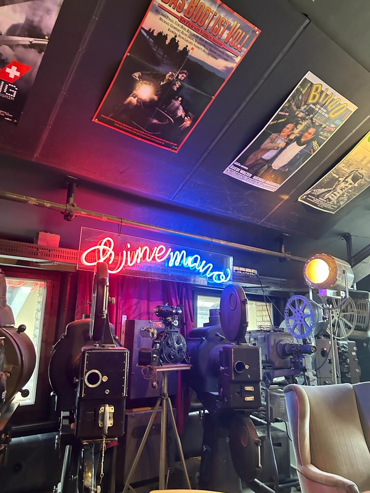
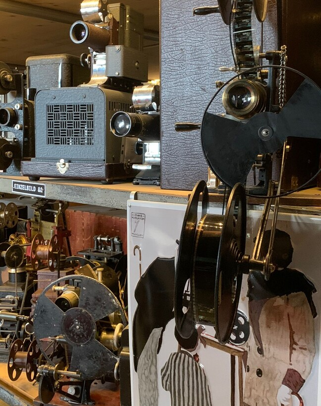

+++
title = "Die Rückkehr der Vergangenheit in die Gegenwart "
date = "2024-02-26"
draft = false
pinned = false
tags = []
image = "whatsapp-bild-2024-01-30-um-14.52.10_fb6ca00d.jpg"
description = ""
footnotes = "In der Fusszeile können zum Beispiel Bildquellen angegeben werden. Dieser Text ist abgetrennt durch eine Linie und etwas kleiner."
+++


Während sich die Welt um uns verändert und die Technologie voranschreitet, bleibt die Geschichte der Filme lebendig – das Lichtspiel-Team in Bern trägt dazu bei, diese Geschichte in ihrer ganzen Faszination am Leben zu erhalten. Jeden Tag zaubert das kleine Team in Bern wahre Magie, um anderen zu helfen, sich daran zu erinnern, wie die Filmindustrie in der Vergangenheit wirklich war.



Yuna Andres und Sofiia Bublyk

Während die Kaffeemaschine leise vor sich hin summt und sich in die Melodie des Ortes einfügt, zieht ein Hauch von Nostalgie durch die Luft. Dieser wird durchdrungen von den unzähligen alten Filmprojektoren, welche wie stumme Zeugen der Filmgeschichte die Räume umgeben. Ein gedämpftes Hallen von Schritten auf dem polierten Betonboden ist zu hören. Es ist ein Ort, der wie eine Zeitkapsel wirkt, voller Schätze und Geschichten, die sich in jedem Winkel verbergen. In den Tiefen von Bern, wo die Vergangenheit auf die Gegenwart trifft, verbirgt sich ein Ort, der mehr als nur ein Kino ist: die Kinemathek Lichtspiel. Hier, zwischen den schlichten Barhockern und den bequemen Kinosesseln, spürt man den Puls der Vergangenheit, der in den Schriftzügen der Neonlichter rhythmisch zu flackern scheint. Die Wände, geschmückt mit Filmplakaten, die wie Fenster in andere Welten wirken, erzählen von einer Zeit, in der das Kino noch ein Ereignis war, ein gesellschaftliches Spektakel. Ein gedämpftes Licht strömt durch das Oberlicht und schafft eine Atmosphäre, die zum Verweilen, Entdecken und Erkunden einlädt. In jeder Ecke, auf jedem Regal, in jeder Glasvitrine findet sich ein Stück Filmgeschichte, sei es eine alte Filmrolle, eine seltene Kamera oder eine vergessene Requisite. Hier verbindet sich die Liebe zum Detail mit der Leidenschaft für das Kino, und das Ergebnis ist ein lebendiges Museum, ein aktives Archiv, das nicht nur bewahrt, sondern auch belebt wird. Mit jedem Film, der hier vorgeführt wird, mit jeder Führung, die durch diese Räume geleitet wird, lebt die Geschichte weiter und inspiriert die Besucher, sich auf eine Reise durch die Zeit zu begeben.

<!--StartFragment-->

#### **Von der Toblerone zur Kinemathek: Die Entstehungsgeschichte des Lichtspiels Bern**    

In den verwinkelten Gassen Berns befindet sich ein Ort, der die Zeit überdauert hat und sich im ständigen Wandel befindet. Ein riesiger Backsteinbau, der von der Berner Brücke aus gut sichtbar ist. Die Kinemathek "Lichtspiel Bern", welcher der Duft von Schokolade zugrunde liegt, ist die Räumlichkeit für die Bewahrung und Präsentation des bewegten Bildes. Die Kinemathek hat ihre Wurzeln tief in der Vergangenheit, und ihre Geschichte ist geprägt von kontinuierlichem Wachstum und Anpassung.

Eine lange Treppe führt hinauf zu dem Ort, an dem die Zeit stillzustehen scheint. Die Türen knarren leise, wenn sie sich öffnen, und der Geruch von Nostalgie und Geschichte liegt in der Luft. Drinnen ist es still, nur das Geräusch von einigen laufenden Maschinen ist zu hören. Am Eingang wird man von einem der Lichtspiel-Mitarbeiter begrüsst. Sein Name ist Raff Fluri und er arbeitet als technischer Leiter  für Veranstaltungen und Ausstellungen der Kinemathek Lichtspiel. Nach der Begrüssung betritt Raff Fluri den grossen Raum, in welchem sich Kinosessel um Kinosessel reiht. Während er sich einen Kaffee macht, spricht er ruhig von der Institution und setzt sich danach mit seinem Kaffee auf einen der Sessel. Nach einigen Interviewfragen beginnt er immer vertiefter von der Geschichte des Lichtspiels zu erzählen.

Es war im Frühling des Jahres 2000, anfänglich waren es nur zwei Menschen, David Landolf und Judith Hofstetter, die das Lichtspiel ins Leben riefen. Ihr Ziel: Die einzigartige Sammlung des Berner Kinotechnikers Walter Ritschard vor dem Verschwinden zu bewahren. Ohne Businessplan und finanzielle Mittel, jedoch mit einem unerschütterlichen Enthusiasmus, wagten sie sich in ein filmreifes Abenteuer, dessen Ausgang sie nicht erahnen konnten. Unterstützt von Zivildienstleistenden und getragen von ihrem unermüdlichen Einsatz, wuchs das Lichtspiel stetig. Von einem kleinen Verein getragen, erlangte es bald überregionale Bekanntheit und Anerkennung. Zwölf Jahre lang fand das Lichtspiel in den Räumlichkeiten einer ehemaligen Chocolat Tobler-Fabrik am Güterbahnhof seinen Platz. Dort, umgeben von einer beeindruckenden Sammlung kinematographischer Schätze, faszinierte es erste Besuchende. Doch der Umzug ins Berner Marzili-Quartier war für das Lichtspiel nicht nur ein Wechsel des Standorts, sondern auch eine Chance. Der Duft von Schokolade wich der faszinierenden Aura der bewahrten Filmgeschichte, während die Lichtspiel-Macher mit einer ausgeprägten Sensibilität für Material- und Ortsgeschichten neue Infrastrukturen schufen und ein beeindruckendes Schaulager errichteten. In enger Zusammenarbeit mit anderen Bewohnerinnen und Bewohnern des Ryff-Areals entstand das Berner Filmhaus, ein Ort, der seitdem die gepflegte Sammelleidenschaft der «Kinematheker» zum Leben erweckt.

Heute, auf 1000 Quadratmetern, bewegt sich das Publikum zwischen Regalen voller kinematographischer Gerätschaften, bestaunt exponierte Raritäten und taucht in den Arbeitsalltag der Kinemathek. Das Zentrum bildet das Kino, das im imposanten Schaulager beheimatet ist. Hier begeben sich die Gäste auf eine Entdeckungsreise durch die Filmgeschichte, begleitet vom Rattern der Projektoren und von Überraschungsprogrammen aus dem eigenen Filmarchiv. Die Kinemathek Lichtspiel ist nicht nur ein Ort der Bewahrung, sondern auch der Vermittlung. Durch Ausstellungen, Kurse zur Kinogeschichte und diverse Vermittlungsprojekte wird die Welt des Kinos erlebbar gemacht. Die Vielfalt des Materials, von Wochenschauen bis zu Amateurfilmen, fasziniert und erstaunt die Besucherinnen und Besucher. Doch hinter den Kulissen des Lichtspiels verbirgt sich mehr als nur eine Sammlung von Filmen und technischem Equipment. Es ist ein Ort, an dem Menschen mit unterschiedlichsten Hintergründen und Fähigkeiten zusammenkommen, um die Wunderwelt des klassischen Kinos am Leben zu erhalten. Von Filmrestauratoren bis zu Technikern, von Historikern bis zu Informatikern – sie alle tragen dazu bei, dass das Lichtspiel seine Leuchtkraft behält. Die Zukunft des Lichtspiels liegt in den Händen des kleinen Teams der 12 engagierten Mitarbeitenden. Wie der technische Leiter für Veranstaltungen und Sammlungen, Raff Fluri erzählt: "Es ist wirklich für jede Institution eine Herausforderung, so viele Aufgaben unter einem Dach aufzuteilen und zu koordinieren. Das ist immer ein Problem, das ständig da ist, dass man viel zu viele Sachen, viel zu viel Arbeit und viel zu wenig Ressourcen hat." Doch das Team des Lichtspiels versucht die Konfrontation der fehlenden Ressourcen durch innovative Lösungsansätze und kontinuierliche Optimierungen anzugehen, um die vielfältigen Aufgaben bestmöglich zu bewältigen. Auch durch die kontinuierliche Anpassung und Weiterentwicklung wird es in den kommenden Jahren ein Ort sein, an dem die Magie des Kinos lebendig bleibt.

#### Archiv: Schätze bergen und Filme auf die Leinwand Zurückholen 

„Wir bringen Vergangenheit und Gegenwart zusammen, indem wir alte Filme in diesem einzigartigen Lichtspielhaus zeigen, und es ist eine Möglichkeit, Filmgeschichten aufleben zu lassen und die alten Schätze einem neuen Publikum zugänglich zu machen.“ Raff Fluri, der technische Leiter für Veranstaltungen und Ausstellungen der Kinemathek Lichtspiel, steht zu diesem Zitat und findet, es trifft vollkommen auf die Kinemathek Lichtspiel zu. Es beschreibt die Institution treffend, da sie genau nach diesem Motto arbeitet und es versucht umzusetzen.

Ein Herzstück der Kinemathek ist das Filmarchiv, das aus etwa 25.000 Filmen besteht. Hierbei handelt es sich größtenteils um Kurzfilme, Werke, die in anderen Kinos oft keinen Platz mehr finden, aber hier Aufmerksamkeit erhalten. Dazu gehören kleine Produktionen, experimentelle Werke, Animationsfilme, Musikvideos, Wochenschauen und Amateurfilmbeiträge. Diese Filme werden nach strengen Standards gesichtet, detailliert in die Datenbank aufgenommen und für die Archivierung vorbereitet. Das Archiv dient als zentrales Instrument für die Arbeit der Kinemathek, von dem aus private und öffentliche Filmprogramme ausgewählt werden (können). Verbunden mit den Katalogen der internationalen Vereinigung der Filmarchive (FIAF), trägt es zur Sichtbarkeit und Forschung bei. Zusätzlich zum Filmarchiv existiert ein Hardware-Archiv, das Gerätschaften zur Filmvorbereitung und -projektion aus verschiedenen Epochen sammelt und bewahrt. Diese Zeitzeugen werden erfasst, revidiert und im Schaulager untergebracht. Manchmal werden sie nach Wartung wieder in Betrieb genommen, während in anderen Fällen Ersatzteile für die Werkstatt gewonnen werden. Dies wird alles durch ein Team aus 27 Personen ermöglicht. In diesem engagierten Team, das sich fast wie eine Familie versteht, hilft jeder jedem, wie es bei einer Führung von einem Teammitglied betont wurde: "Da wir auch ein kleines Team sind und jeder jedem hilft, ist das hier fast schon wie eine kleine Familie." Durch die funktionierende Teamarbeit wird es ermöglicht, das Archiv in Gang zu halten.

Die Sammlung an Papierdokumenten bildet einen weiteren Teil des Archivs, reichend von Filmplakaten bis zu Handbüchern für verschiedene Geräte. Diese historischen Dokumente werden sorgfältig bewahrt, und auf Anfrage gewährt die Kinemathek Einsicht in diese Schätze. Ihr Ziel ist es, ein Archiv bereitzustellen, das zugänglich und lebendig bleibt, Sichtbarkeit besitzt und weiterhin genutzt wird, ohne dabei die Integrität der Archivbestände zu beeinträchtigen. Der Fokus liegt dabei auf der Bewahrung der Authentizität und Integrität des Kulturerbes. Die Digitalisierung sieht die Kinemathek Lichtspiel nicht als Ersatz, sondern als Ergänzung zur analogen Archivarbeit. Es werden Strategien entwickelt, um den besonderen Charme und die Atmosphäre des Lichtspiels auch im digitalen Raum zu bewahren. In diesem Sinne definiert sich die Kinemathek als ein modernes, vielseitig zugängliches und qualitativ hochwertiges Archiv.

#### Museum: Bewahren und sichtbar machen

An der Sandrainstrasse 3 in Bern bringt das Lichtspiel-Team Filme aus der Vergangenheit zurück. In öffentlich zugänglichen Räumen werden Artefakte der Kinogeschichte gesammelt, bewahrt und präsentiert. Ein sich ständig veränderndes Schaulager beherbergt Maschinen, Utensilien von Filmsets und weiteres Kinomaterial. Projektoren in allen Formen und Farben, Visionierungstische, Kameras, Stative und Plakate. Zusätzlich prägt eine einzigartige Sammlung von Laterna Magicas das Erscheinungsbild des Lichtspiels. Diese umfangreiche Sammlung, grosszügig vom Nachlass von Heinz Leuenberger überlassen, ist in einem eigen dafür gestalteten Raum zu bewundern und dokumentiert eine wichtige Entwicklungsphase in der Geschichte der Kinemathek Lichtspiel.

Die Kinemathek betrachtet das Museum als Vermittlungsort durch verschiedenste Versuchs Möglichkeiten. Die Sammlung und Konservierung der Objekte sind Hauptanliegen, aber ebenso wichtig ist es, die Gerätschaften funktionsfähig zu halten. Dies geschieht durch das Team des Lichtspiel Berns, doch wie im Interview durch Raff Fluri angedeutet steht nicht viel Geld zur Verfügung; "Von mir aus gesehen ist man wirklich wegen dem Team auch da, weil viel Geld verdient man nicht, oder es ist nicht sehr viel Geld vorhanden für eine Institution wie unsere." Um Geld geht es den Mitarbeitern der Kinemathek Lichtspiel nicht, der Schwerpunkt liegt auf der Erhaltung der Vergangenheit und wie ebenfalls erwähnt auf der guten Atmosphäre zwischen den Teammitgliedern, welche die Zusammenarbeit mit Gleichgesinnten ermöglichen. Die Restaurierungsprojekte dienen nicht nur der Erhaltung, sondern ermöglichen es auch, die Geräte für Vorführungen zu nutzen.

Als Institution ist die Kinemathek Mitglied der Museen Bern und kooperiert mit anderen Museen auf verschiedenen Ebenen. Dennoch prägt das Lichtspiel einen eigenen "Museums-Ansatz" – verspielt, neugierig, begehbar, sichtbar, riechbar und hörbar. Die Kinemathek Lichtspiel bleibt somit nicht nur ein Ort der Vergangenheit, sondern auch ein lebendiger Raum für die Zukunft der Filmkultur.

#### Filmreif ins Neue Jahr: Silvesterzauber im Lichtspiel Bern

Trotz des festlichen Silvesterabends behält das Lichtspiel seine typische Ausstrahlung bei und bietet eine unvergleichliche Atmosphäre, die den Abend zu einem einzigartigen Erlebnis macht. Die schillernden Neonlichter und die dezenten Lichterketten setzen den Ort in ein gemütliches, einladendes Licht, das die perfekte Kulisse für den Jahresausklang bietet. Während draussen die letzten Stunden des Jahres verstreichen, scheint die Zeit zwischen den historischen Filmutensilien wie stehen zu bleiben. Zeitgleich wird die Luft auf den Strassen von jubelnden Menschen und knallenden Feuerwerkskörpern erfüllt, doch das Lichtspiel schafft im Inneren eine Oase der Ruhe für unvergessliche filmische Erlebnisse. Die Besucher strömen durch die Türen des Lichtspiels Bern und versammeln sich zu einem festlichen Treiben inmitten alter Filmrequisiten. An der Eingangstüre werden sie von festlich gekleideten Mitarbeitenden herzlich empfangen und auf einen stilvollen Abschied vom alten Jahr eingestimmt. 

Die Sonntagabende in der Kinemathek Lichtspiel sind weit mehr als nur filmische Veranstaltungen; sie sind regelrechte kulturelle Ereignisse, die eine einzigartige Atmosphäre der Vorfreude und des gemeinsamen Erlebens schaffen. Die Uhr schlägt 19:00 Uhr, die Bar öffnet ihre Türen, und die Gäste haben die Gelegenheit, einen Drink zu nehmen oder durch das offene Museum zu schlendern. Alte Filmrequisiten, darunter Kameras und Projektoren aller Art, stehen offen zur Bewunderung bereit, während die Besucher verschiedene kleine Experimente ausprobieren können. Die Stimmung ist lebhaft und herzlich. Menschen jeden Alters versammeln sich an der Bar, tauschen Geschichten aus und geniessen die einzigartige Atmosphäre des Lichtspiel Berns.

Kurz bevor das Programm um 20 Uhr startet, begrüßt ein Mitarbeiter des Lichtspiels das Publikum und gibt einen kurzen Einblick in den bevorstehenden Film sowie das behandelte Thema. Diese Einführung steigert die Erwartung und Neugierde der Zuschauer, die gespannt darauf warten, in eine andere Welt einzutauchen. "Bei uns hat eine Kinovorführung viel mehr noch diesen Eventcharakter als bei einem Mainstream Kino, wo halt immer derselbe Film einfach automatisiert durchläuft. Wir versuchen auch jeden Film einzuführen, also dass jemand zuvor die Zuschauer begrüsst und noch ein paar Worte dazu sagt." erklärt Raff Fluri, Mitarbeiter des Lichtspiels, im geführten Interview. 

"Bei uns hat eine Kinovorführung viel mehr noch diesen Eventcharakter als bei einem Mainstream Kino, wo halt immer derselbe Film einfach automatisiert durchläuft. Wir versuchen auch jeden Film einzuführen, also dass jemand zuvor die Zuschauer begrüsst und noch ein paar Worte dazu sagt." erklärt Raff Fluri, Mitarbeiter des Lichtspiels, im geführten Interview. Kurz vor Beginn des Programms, das um 20:00 Uhr startet, begrüßt ein Mitarbeiter des Lichtspiels das Publikum und gibt einen kurzen Einblick in den bevorstehenden Film sowie das behandelte Thema. Diese Einführung steigert die Erwartung und Neugierde der Zuschauer, die gespannt darauf warten, in eine andere Welt einzutauchen.

Das Besondere an den Veranstaltungen der Kinemathek Lichtspiel ist die beeindruckende Vielfalt des Programms. Seit mehr als 1.200 Wochen präsentiert das Lichtspiel jeden Sonntagabend ein Kurzfilmprogramm mit Fundstücken aus dem eigenen Archiv, das rund 30.000 Filme umfasst. Dabei handelt es sich nicht nur um Mainstream-Filme, sondern um eine faszinierende Mischung aus Werbungen, Trailern, Dokumentarfilmen, Wochenschauen, Experimentellem, Amateurmaterial und Musikclips. Diese Collagen, die sich locker um einen Schwerpunkt ergeben, führen zu emotionalen Tränen, herzhaftem Gelächter, schaurigen Momenten, seelischer Berührung, durchbrechendem Schweigen oder stummer Betrachtung.

Das Sonntagsprogramm im Lichtspiel Bern überrascht seine Besucher stets aufs Neue, da es sich um ein Überraschungsprogramm handelt, bei dem Filme zu bestimmten Themen gezeigt werden, die im Voraus nicht bekannt sind. Diese einzigartige Kombination aus analogen Projektionen und modernem Streaming verleiht den Vorführungen einen besonderen Eventcharakter. Neben dem filmischen Programm bietet das Lichtspiel auch Dienstleistungen wie die Digitalisierung von Filmmaterial an. Hier zeigt sich die Expertise des Lichtspiels in der Filmrestaurierung, was es von kommerziellen Anbietern abhebt und so auch einen bedeutenden Beitrag zur Erhaltung und Pflege filmischer Geschichte beiträgt.

Als Zusätzliche Veranstaltungen bietet die Kinemathek Lichtspiel verschiedene thematische Reihen, wie beispielsweise zur Filmgeschichte an und pflegt eine enge Zusammenarbeit mit dem Kino Rex, welches ebenfalls nicht kommerzielle Filme und Kinofilme aus der Vergangenheit auf seiner Leinwand zeigt. Sogar Premieren neuer Filme finden ihren Weg in das Lichtspiel Bern. Doch der Fokus liegt hauptsächlich auf den Sonntagabenden mit den Überraschungsprogrammen. Die Kinovorführungen tragen zu einem Erlebnis bei, das man im Mainstream Kino nicht mehr erleben kann. Das jeweilige Filmprogramm wird Zuschauern seit einigen Jahren auch von zu Hause aus zugänglich gemacht. Über einen Live-Stream, welcher über die Website “Vimeo” gestreamt wird, ist es für die Zuschauer seit einigen Jahren möglich, das Filmprogramm auch von zu Hause aus mitzuverfolgen.



**Zur Institution:**

Das Lichtspiel wurde 2012  in Bern gegründet und ist seit 10 Jahren am aktuellen Standort in der Sandrainstrasse 3 in Bern. Seit der Eröffnung des Lichtspiels werden jeden Sonntagabend zwei Filmrollen mit kurzen Filmen aus dem Archiv zusammengestellt, die einen Einblick in die Filmsammlung der Kinemathek geben. Im Weiteren finden thematische Filmzyklen und Retrospektiven statt. 

**Zur interviewten Person:**

Raff Fluri, geboren 1980 in Bern, Schweiz. Seit 2004 in der Kinobranche sowie als freischaffender Filmemacher tätig. Machte 2018-19 sein Studium an der FAMU International (Film and TV School of the Academy of Performing Arts) in Prag. Seit 2020 arbeitet Raff Fluri in der Kinemathek Lichtspiel, als technischer Leiter für Veranstaltungen und Ausstellungen.

