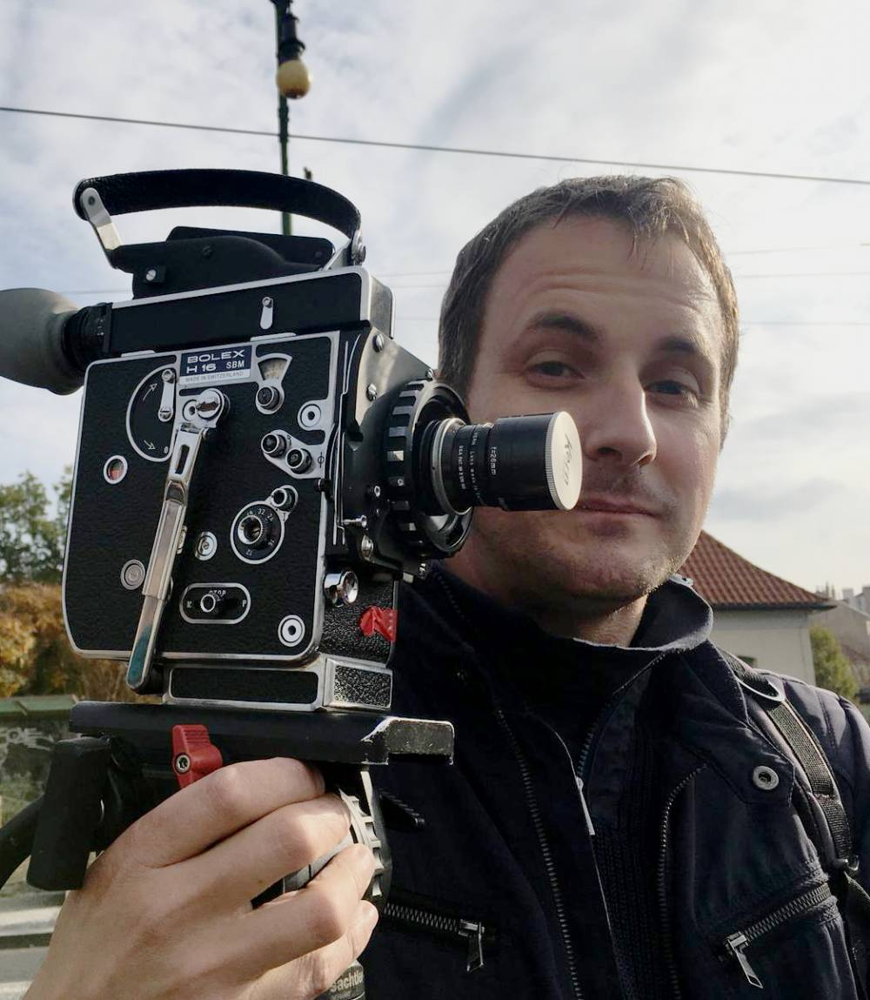

+++
title = "Hollywood-Remakes: Schwache Teile des Kino"
date = "2024-02-26"
draft = false
pinned = false
image = "fluri_raff_24fcc905086d45bf867c35953cf929cb.jpg"
+++


In einer Zeit des digitalen Wandels und der kulturellen Transformation ist das Lichtspielhaus ein einzigartiges kulturelles Juwel in Bern. Das Team leistet eine einzigartige Arbeit, indem es alte Filme zeigt und lebendige Veranstaltungen organisiert. Trotz der Herausforderungen durch fehlende Ressourcen gelingt es dem Lichtspielhaus, die Menschen mit seinen Projekten zu begeistern.

 

Yuna Andres und Sofiia Bublyk 

Inmitten des vierten Stocks erstreckt sich eine bunte Vielfalt an Dekorationen, darunter Kameras, Plakate, Lichterketten, Maschinen und Jukeboxen unterschiedlicher Art und Größe. Ganz oben neben einer kleinen Bar nimmt Raff Fluri Platz, um seine persönliche Verbindung zum Lichtspiel zu teilen. Der 44 Jahre alte technische Leiter für Veranstaltungen und Ausstellungen ist seit 2020 fest angestellt, vertraut mit dem Lichtspiel ist er jedoch schon seit Anfang an. Nebenbei ist er Recorder, Produzent, Drehbuchautor, Cutter, Regisseur, Kameramann, Tonmischer, Sounddesigner und Komponist.

#### Könnten Sie uns einen Einblick in Ihre Aufgaben und Verantwortlichkeiten geben?

Ich bin hauptsächlich  für die Projektionstechnik  der Events und die technische Realisierung im Kino verantwortlich. Zusätzlich kümmere ich mich um Social Media und arbeite an Projekten, bei denen Filme oder Geräte restauriert werden, und dazu Texte oder Publikationen verfasst werden. Meine Tätigkeiten sind sehr vielfältig und reichen über verschiedene Abteilungen.

#### Ist eine spezielle Ausbildung erforderlich, um in diesem Bereich zu arbeiten?

Es gibt verschiedene Ausbildungen, da meine Arbeit interdisziplinär ist. Technische Berufe und Filmgeschichte sind gängige Hintergründe. In unserem Team finden sich auch unterschiedliche Fachrichtungen. Ich persönlich habe Betriebswirtschaft studiert, später Filmrestaurierung und Kameraerfahrung dazu gelernt.

#### Was ist für Sie bei der Arbeit wichtig? Die Zusammenarbeit im Team?

Absolut. Der Teamaspekt ist entscheidend, da die finanziellen Ressourcen begrenzt sind, besonders in der Kulturbranche. "Von mir aus gesehen ist man wirklich wegen dem Team auch da, weil viel Geld verdient man nicht, oder es ist nicht sehr viel Geld vorhanden für eine Institution wie unsere." Doch die Motivation entsteht aus Freude an der Arbeit und der Überzeugung, dass es wichtig ist, das audiovisuelle Erbe der Schweiz zu bewahren und zugänglich zu machen.

#### Können Sie uns etwas über die Highlights der Sammlung des Lichtspiels und ihre Bedeutung in der Filmgeschichte erzählen?

Die Sammlung ist umfangreich, und wir arbeiten ständig daran, sie zu pflegen. Aktuell überlegen wir, uns auf Schweizer Filme zu konzentrieren, insbesondere auf den Bereich Amateurfilm. Die genaue Definition unseres Sammlungsschwerpunkts ist eine laufende Herausforderung.

#### Wie organisieren Sie die vielfältigen Aufgaben im Lichtspiel?

Die Koordination ist eine immense Aufgabe, besonders weil wir viele Festangestellte mit unterschiedlichen Teilzeitanstellungen haben. Die Herausforderung besteht darin, die Zusammenarbeit und den Austausch zu optimieren, da wir oft nicht alle gleichzeitig anwesend sind. "Es ist wirklich für jede Institution eine Herausforderung, so viele Aufgaben unter einem Dach aufzuteilen und zu koordinieren. Das ist immer ein Problem, das ständig da ist, dass man viel zu viele Sachen, viel zu viel Arbeit und viel zu wenig Ressourcen hat."

#### Wie entstand das Lichtspiel, und gab es einen speziellen Grund für seine Gründung?

Ursprünglich war es die Sammlung eines Kinotechnikers, Walt Richard, der viele Kinos in Bern ausgestattet hatte. Nach seinem Tod entdeckte David Landolf, der Gründer des Lichtspiels, diese Sammlung und startete das Projekt und gründete einen Verein, um sie zugänglich zu machen. Die Sammlung hat sich im Laufe der Zeit verändert und umfasst nun mehrere große Bestände sowie viele Beiträge von Privatpersonen.

#### Was macht eure Herangehensweise besonders im Vergleich zu anderen Kinos?

Wir zeichnen uns durch ein vielfältiges Programm aus, zeigen nicht täglich denselben Film, haben spezielle Reihen, Filmpremieren und ein Überraschungsprogramm am Sonntagabend. "Bei uns hat eine Kinovorführung viel mehr noch diesen Eventcharakter als bei einem Mainstream Kino, wo halt immer derselbe Film einfach automatisiert durchläuft. Wir versuchen auch jeden Film einzuführen, also dass jemand zuvor die Zuschauer begrüsst und noch ein paar Worte dazu sagt." Ausserdem bieten wir Filmrestaurierung und Digitalisierung mit professionellem Know-how an.

#### Wie werden die Filme im Archiv konserviert und geschützt?

Wir haben einen haupt zuständigen Leiter und einige ausgebildete Mitarbeiter für die Erfassung, Reinigung und Inspektion der Filme verantwortlich. Die Filme werden dann in speziellen Dosen gelagert und in einem Kühlraum aufbewahrt, um ihre Haltbarkeit zu gewährleisten. Dabei wird auf eine kontrollierte Temperatur und Luftfeuchtigkeit geachtet.

#### Werden im Lichtspiel hauptsächlich ältere Filme gezeigt, obwohl viele bereits digitalisiert sind?

Es gibt eine Vielfalt im Programm, einschliesslich älterer und neuerer Filme. Es werden auch Premieren von neuen Filmen gezeigt, insbesondere von Berner Filmemachern. Die Auswahl hängt von verschiedenen Faktoren ab, darunter auch Themenreihen und Filmgeschichtsprojekte.

#### Gibt es Filme, die Ihnen besonders am Herzen liegen?

Mit meiner intensiven Beschäftigung mit Filmen wechselt meine Vorliebe häufig. Es gibt viele faszinierende neue und alte Filme, aber es ist schwer, einen Favoriten zu benennen. Die Vielfalt und Entwicklung des Mediums machen es schwierig, sich auf eine Top-Ten-Liste festzulegen.

#### Wie sehen Sie die Tendenz, dass trotz der Digitalisierung immer noch ältere Filme bevorzugt werden?

Es könnte mit der Flut von Remakes aus Hollywood zu tun haben. Man sieht immer mehr Neuverfilmungen von bereits existierenden Stoffen, anstatt auf Originalstoffe zurückzugreifen. Die Entscheidung für ältere Filme könnte auch daran liegen, dass sie zeitlos sind und in ihrer Zeit geschaffen wurden. Es ist eine individuelle Präferenz, die stark vom Film selbst abhängt.

#### Passt das Zitat  „Wir bringen Vergangenheit und Gegenwart zusammen, indem wir alte Filme in diesem einzigartigen Lichtspielhaus zeigen, und es ist eine Möglichkeit, Filmgeschichten aufleben zu lassen und die alten Schätze einem neuen Publikum zugänglich zu machen.“ zu Ihrer Institution?

Ja, absolut. Wir nutzen digitale Medien, um Geschichten zu präsentieren und das Publikum einzubeziehen. Die Verbindung von alten Schätzen mit einem neuen Publikum ist ein zentraler Aspekt unserer Arbeit.

> Bei einer Führung wurde von einem Teammitglied folgendes betont: *"Da wir auch ein kleines Team sind und jeder jedem hilft, ist das hier fast schon wie eine kleine Familie."* 



**Zur Institution:**

Das Lichtspiel wurde 2012 gegründet in Bern und ist seit 10 Jahren am aktuellen Standort in der Sandrainstrasse 3 in Bern. Seit der Eröffnung des Lichtspiels werden jeden Sonntagabend zwei Filmrollen mit kurzen Filmen aus dem Archiv zusammengestellt und ermöglichen einen Einblick in die Filmsammlung der Kinemathek. Im Weiteren finden thematische Filmzyklen und Retrospektiven statt. 

**Zur interviewten Person:**

Raff Fluri, geboren 1980 in Bern, Schweiz. Seit 2004 in der Kinobranche sowie als freischaffender Filmemacher tätig. 2018-19 Studium an der FAMU International (Film and TV School of the Academy of Performing Arts) in Prag. Seit 2020 arbeitet Raff Fluri in der Kinemathek Lichtspiel, als technischer Leiter für Veranstaltungen und Ausstellungen.



<!--EndFragment-->